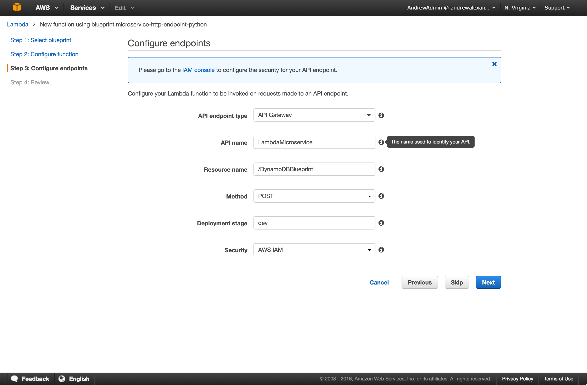
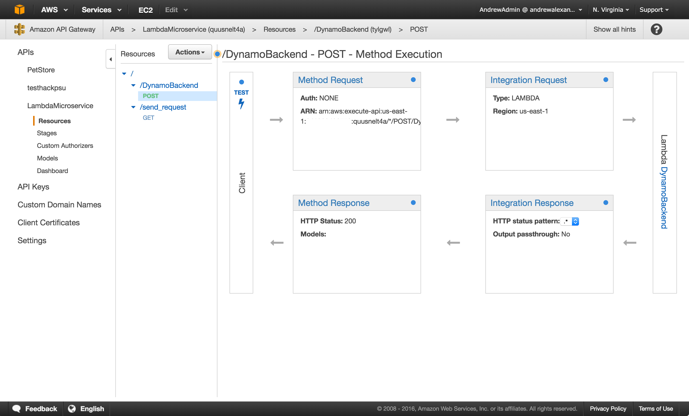

# Carbon Hackathon AWS Lambda Hacks
## TL;DR for lambda: 
No server, just code. Code runs in response to events or on a fixed schedule. You are charged for execution time of your code.

## Slightly longer description
I could go on and on about how great Lambda is here, but you can read all about that elsewhere on the internet. Instead, hopefully the use cases speak for themselves.

Some common use cases:
- Automatically interact with a database
  * Create a user
  * Update course content
  * Whatever else it is you are doing with your data
- Automatically transcode video/images as soon as they're uploaded to a `raw` bucket
  * Whenever an object is uploaded, trigger any number of subprocesses for image manipulation
- Automatically notify users of a completed task via email/text
  * Can use Simple Notification Service (SNS) or Simple Email Service (SES) or any other means of notification through an API
- Automatically run any code you want on a schedule
- Automatically respond to a physical action (Arduino sensor) or send a signal to a physical device that can accept REST calls
- Automatically invoke any number of other REST APIs (internal or external)
- Run any combination of the above asynchronously with no worried about scalability

# Walkthrough: Event Based Lambda function - DynamoDB
By far the most common use case of [AWS Lambda](https://aws.amazon.com/documentation/lambda/) functions is event-based functions. These are functions that are executed when a particular AWS API action is done. The code can be anything - it can be used to send an email/text message, it can trigger other lambda functions in a cascading chain of Lambdas, or it can be used to call some other API (Twilio, Nessie, any other Hackathan API)

A great example of a production workload using "serverless architecture" is [A Cloud Guru](https://acloud.guru/). Anything on their website that is dynamically generated content that would normally require a server instead uses Lambda functions. Between A Cloud Guru, [Serverless](https://github.com/serverless/serverless), and [Apex](https://github.com/apex/apex), Lambda functions in particular are popularized more and more as much more cost-effective alternatives to traditional server/backend designs. 

## Automatic database manipulation
Most of the use cases involve some sort of interaction with a database.

Imagine you are creating a web app or mobile app and you want to create/modify/delete an entry in a database. Building a traditional backend/API is totally viable (Express, Strongloop/Loopback, Django, and Flask are all completely valid choices for backends), but a lambda function can be a much simpler solution in some circumstances, especially if you are using DynamoDB as your database. Amazon provides easy paths to adoption when you use all of their services for everything. Beware of vendor-lock! 

There are actually "blueprint"s provided by Amazon for various Lambda function use cases in both Node.js and Python flavors. These blueprints have boilerplate code for a [DynamoDB](http://docs.aws.amazon.com/amazondynamodb/latest/gettingstartedguide/Welcome.html) microservice/backend for Lambda that we are going to piggyback off of.

We are going to be building out that DynamoDB example because Amazon has done most of the work for us already.

### Build the Lambda function

Select the `microservice-http-endpoint` or `microservice-http-endpoint-python` blueprints when you click `Create a Lambda function` in the AWS Lambda console.

Your lambda function should have DynamoDBFullAccess IAM permissions (IAM Role) so that it can talk to DynamoDB. (I can talk about IAM for hours, so it's best to just leave this [link to the docs](https://aws.amazon.com/documentation/iam/) instead).

Follow the prompts to let Lambda create your API for you. The only setting you need to modify is the Method type from `GET` to `POST`. Note that you can/should change the API name from LambdaMicroservice to something more becoming of your hack. This guide will continue to use that name for the demo. 

See [here](http://docs.aws.amazon.com/amazondynamodb/latest/gettingstartedguide/GettingStarted.NodeJs.03.html#GettingStarted.NodeJs.03.01) for more information about the proper JSON/Node.js structure to get the various endpoints to work as you expect them to.

### Create the DynamoDB table
Go to the DynamoDB console and create a new table. Make the primary key `username` for the purposes of this demo. This key is used to identify a particular entry in the database. You can theoretically make it whatever you want, but that would involve a much more lengthy primer on DynamoDB. This is a lightning talk, after all. Read the [getting started guide](http://docs.aws.amazon.com/amazondynamodb/latest/gettingstartedguide/Welcome.html) for more complete information about DynamoDB. 

That't it - just make the table and you are good to go.
    
### Test from API Gateway
Go to the API Gateway console. You should see the LambdaMicroservice API with a description of _Created by AWS Lambda_. Click that to see the API we created. In a tree view, you should see the name of the API you created along with any resources underneath. In my example, the resource is `/DynamoBackend`, and underneath that resource we have a single `/POST` endpoint. Click the POST endpoint and you are presented with a flowchart of the API. Each of those links can be clicked to configure your API. For now, click the TEST button with the lightning bolt under it to bring up the test screen. 

You can use the json documents included in the `dynamo_backend` folder as inputs for the test box. Be sure to change the name of your lambda function to match!

You now have a working API (sort of)!

#### Deploy API with API token
This is all well and good while you have console access, but in order to actually be useful in a hack, you will need to be able to use an API token (at minimum) in order to authorize access to the API. 

To do this, just click `API Keys` on the left, and generate a new key. Be sure to associate your new endpoint with the key and click Save. Now you can use this key in an `x-api-key` header and you will have full access to your API once we deploy.

To deploy, just click Actions -> Deploy API. You can change settings here if you want to, but you can always change them later and/or re-deploy your API key. 

To change settings later, go to APIs -> LambdaMicroservice -> DynamoBackend -> Stages.

Once you deploy the API, you will be given an actual URL that you can use for typical REST API calls like you would in any other language. You can export the Swagger UI JSON/YAML for easy generation of API docs. You can also generate an SDK for easy incorporation into an iOS/Android/JavaScript project. 

I like to use [Postman](https://www.getpostman.com/) for testing APIs, since it makes it super easy to add headers/edit the payload being sent. 

## Other Event-based Lambdas:
Time permitting, we can walk through some of these as well. If not, I will be available until 2:30/3PM for office hours!

- S3
  * Perform image manipulation in response to new S3 objects
  * Automatically encrypt any/all S3 objects
- SNS
  * Unique for each event
  * Can be used as trigger for any Lambda
- Alexa
  * Create your own voice commands that execute as Lambda functions
  * _Caveat_: I've never gotten a chance to mess with Alexa yet
- CloudWatch Events
  * Nearly all AWS APIs (EC2 creation, RDS creation/updates, Lambda creation/updates)
  * Usually used for notification/compliance purposes
