# AWS Lambda for Hackathons
## TL;DR for lambda
No server, just code. Code runs in response to events or on a fixed schedule. You are charged for execution time of your code.

## Slightly longer description
I could go on and on about how great Lambda is here, but you can read all about that elsewhere on the internet. Instead, hopefully the use cases speak for themselves.

Some common use cases:
- Automatically interact with a database
  * Create a user
  * Update course content
  * Whatever else it is you are doing with your data
- Automatically transcode video/images as soon as they're uploaded to a `raw` bucket
  * Whenever an object is uploaded, trigger any number of subprocesses for image manipulation
- Automatically notify users of a completed task via email/text
  * Can use Simple Notification Service (SNS) or Simple Email Service (SES) or any other means of notification through an API
- Automatically run any code you want on a schedule
- Automatically respond to a physical action (Arduino sensor) or send a signal to a physical device that can accept REST calls
- Automatically invoke any number of other REST APIs (internal or external)
- Run any combination of the above asynchronously with no worries about scalability

# Walkthrough: Event Based Lambda function - DynamoDB
By far the most common use case of [AWS Lambda](https://aws.amazon.com/documentation/lambda/) functions is event-based functions. These are functions that are executed when a particular AWS API action is done. The code can be anything - it can be used to send an email/text message, it can trigger other lambda functions in a cascading chain of Lambdas, or it can be used to call some other API (Twilio, Nessie, any other Hackathan API)

A great example of a production workload using "serverless architecture" is [A Cloud Guru](https://acloud.guru/). Anything on their website that is dynamically generated content that would normally require a server instead uses Lambda functions. Between A Cloud Guru, [Serverless](https://github.com/serverless/serverless), and [Apex](https://github.com/apex/apex), Lambda functions in particular are popularized more and more as much more cost-effective alternatives to traditional server/backend designs.

### Quick Links 
You will likely want to get [Postman](https://www.getpostman.com/) for working with your API, as well as install the [AWS CLI](http://docs.aws.amazon.com/cli/latest/userguide/installing.html) to make the setup of other AWS SDKs easier. 

## Automatic database manipulation
Most of the use cases involve some sort of interaction with a database.

Imagine you are creating a web app or mobile app and you want to create/modify/delete an entry in a database. Building a traditional backend/API is totally viable (Express, Strongloop/Loopback, Django, and Flask are all completely valid choices for backends), but a lambda function can be a much simpler solution in some circumstances, especially if you are using DynamoDB as your database. Amazon provides easy paths to adoption when you use all of their services for everything. Beware of vendor-lock! 

There are actually "blueprint"s provided by Amazon for various Lambda function use cases in both Node.js and Python flavors. These blueprints have boilerplate code for a [DynamoDB](http://docs.aws.amazon.com/amazondynamodb/latest/gettingstartedguide/Welcome.html) microservice/backend for Lambda that we are going to piggyback off of.

We are going to be building out that DynamoDB example because Amazon has done most of the work for us already.

### Create your IAM user
If you are still logging into the console using the root account (i.e. you used an email address to login), *stop*! There's a number of reasons why this is bad, but that's outside of the scope of this walkthrough. It's in the [Amazon Security Best Practices](https://d0.awsstatic.com/whitepapers/Security/AWS_Security_Best_Practices.pdf) whitepaper if you want to read more about why you want to secure the root account.

In any case, even if you are using an IAM user already, you will still want to create a new IAM user for this demo. It is always good to limit things to their proper scope, and it also helps to keep application vs. human users separate.

Go to the IAM Console and click on Users. Then click Create Users.

Now just enter the desired username and leave the box to generate access keys checked.

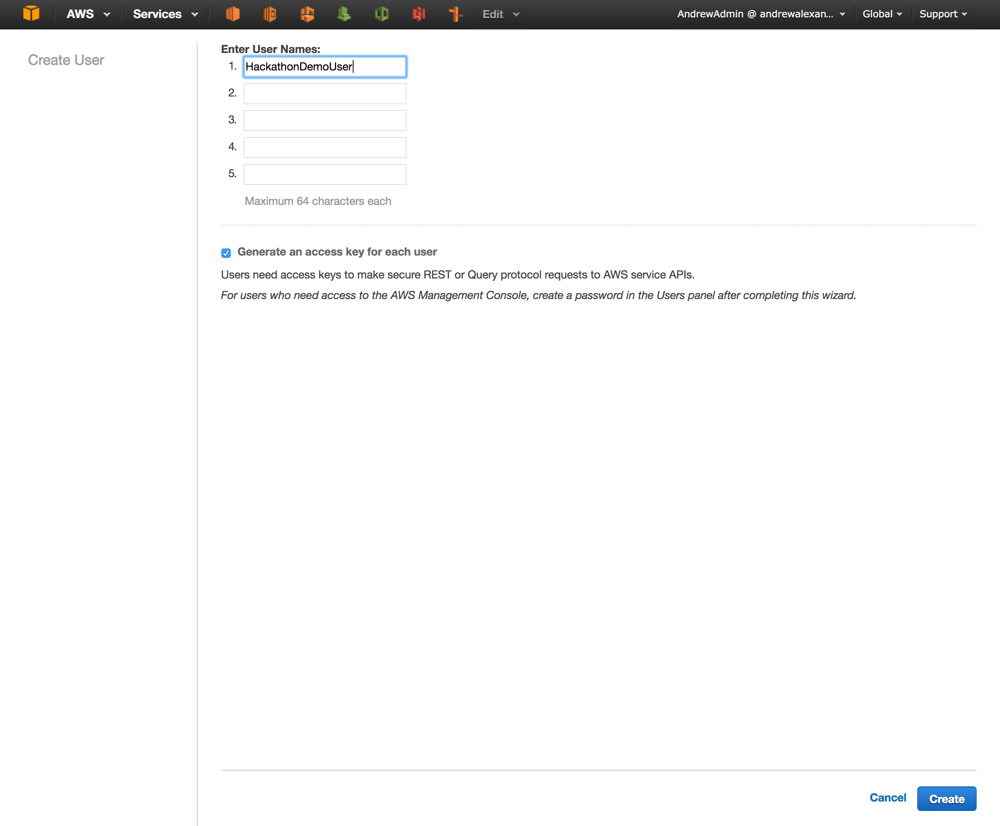

The next step presents you with keys to download for the user. This is the one and only time these are presented, so be sure to download them!

By default IAM users have *ZERO* permissions, meaning they can't even log into the console (they also don't have a password by default, so if you want to login with a password, you have to create one after you create the user). To deal with this, we will be attaching the Amazon-provided `PowerUserAccess` policy. To do this, select the user in the IAM Console -> Users screen. Then navigate to the Permissions tab and click `Attach Policy`. Enter 'PowerUser' in the search bar and select the `PowerUserAccess` policy and click `Attach`. 

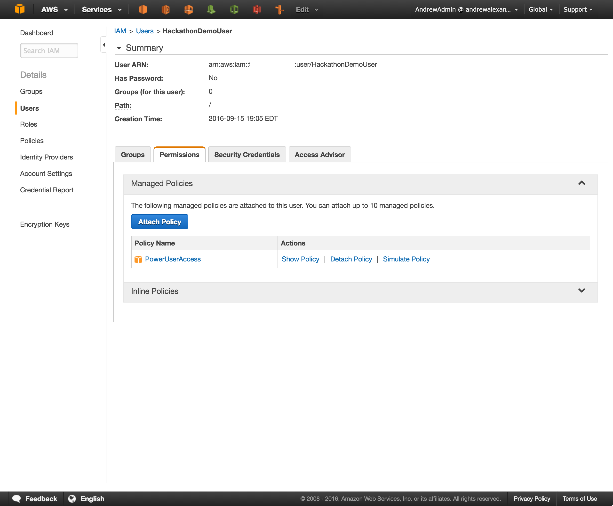

Now you have the necessary permissions!

### Build the IAM Role for Lambda
Lambda does offer to build you a role if it's your first time launching, but we want more than the `lambda_basic_execution` role that it tries to build for us. For this walkthrough, we need to grant Lambda access to DynamoDB.

To do this, click on roles on the left hand side of the IAM Console and click Create Role. 

The first step is to give the role a name. It can be anything you want, as long as it doesn't include some special characters. The console complains if you have one of them. 

The next step is to select the role type. Without going into details on all of the types, these options allow us to create roles that various other Amazon services can "assume" to do tasks on our behalf. In this example, we are working with Lambda, so we want to select `AWS Lambda` in the console.

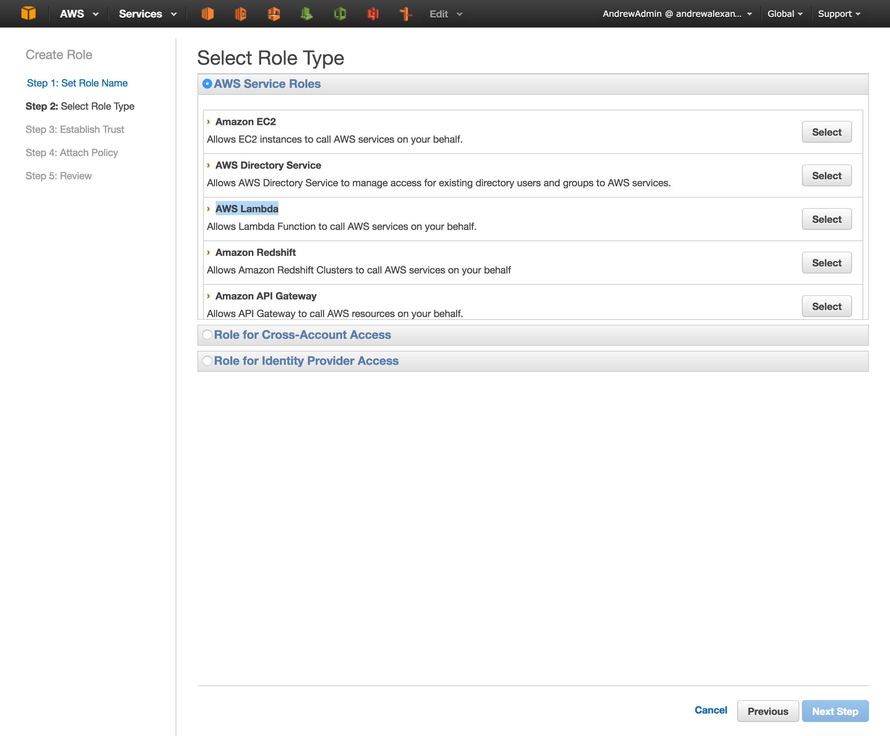

Now, just like before, we need to attach a policy. This time we are going to attach two policies that we need. We want the `AmazonDynamoDBFullAccess` and `CloudWatchLogsFullAccess`. Even though we can't see the whole name in the console, you can hover over the entry to get the full name of the role. When you search for the first one, just select the check box and search for the second. Both of them will remain selected even though the results will leave from the console.

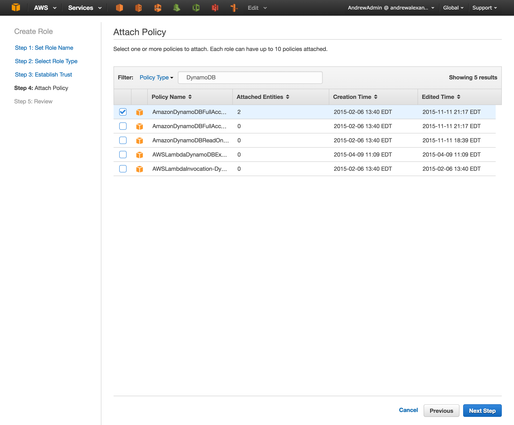 
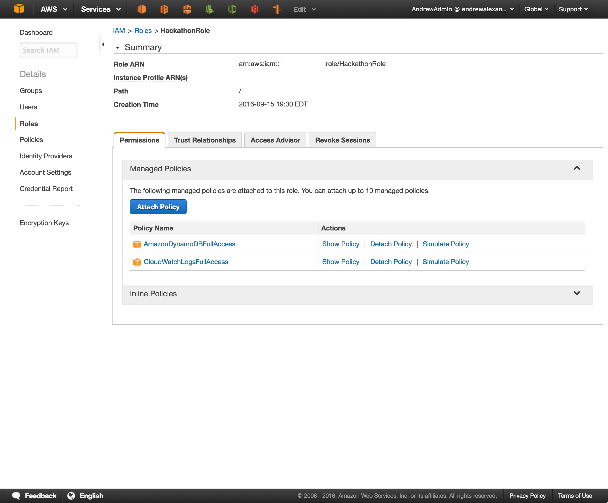

You will be presented with a summary. If you are satisfied, go ahead and click `Create Role`. Now we are ready for Lambda!

### Build the Lambda function

Select the `microservice-http-endpoint` or `microservice-http-endpoint-python` blueprints when you click `Create a Lambda function` in the AWS Lambda console.

On the next step, we want to select API Gateway as our trigger. It may pre-populate the API name to LambdaMicroservice or another API from API Gateway (if you have created one previously). If that's the case, you can just enter whatever name you'd like for `API name` instead and it will create the API for you with that name.

Change resource name to `/` - this is what follows at the end of the URL. For example, if you wanted to POST to `https://your-api-gateway-url-here/DynamoBackend`, you would put `/DynamoBackend` as your resource here. The screenshot below shows the `/` endpoint, but the later API Gateway screenshot shows the `DynamoBackend` endpoint as well to reiterate this point.

Change the Method to `POST`

Set Security to `Open with access key`

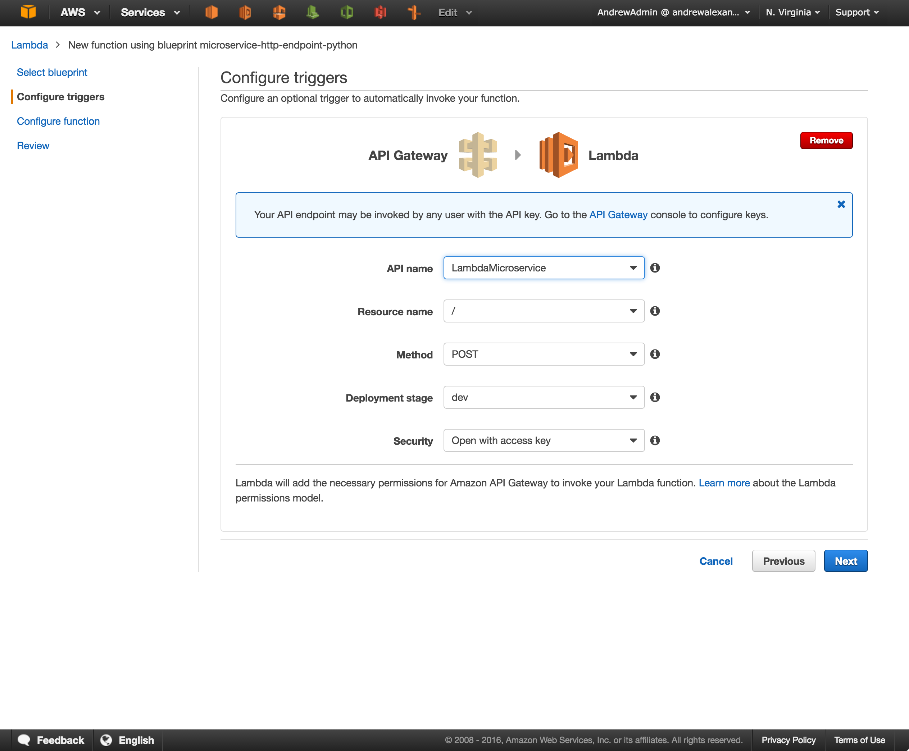

On the next screen, give your lambda function a unique name and then scroll down and be sure to select `Choose an existing role` and select the role we created earlier so our lambda can talk to Dynamo. 

See [here](http://docs.aws.amazon.com/amazondynamodb/latest/gettingstartedguide/GettingStarted.NodeJs.03.html#GettingStarted.NodeJs.03.01) for more information about the proper JSON/Node.js structure to get the various endpoints to work as you expect them to.

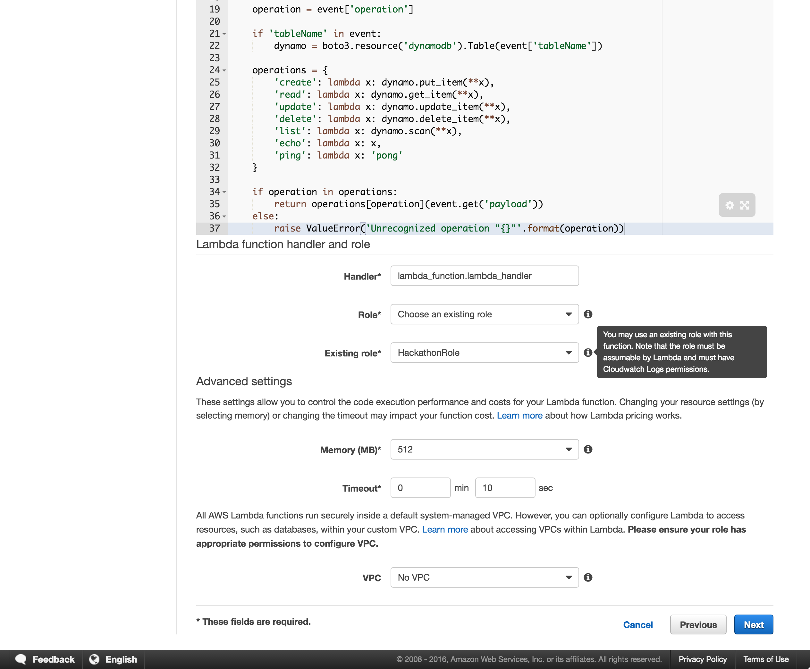

### Create the DynamoDB table
Go to the DynamoDB console and create a new table. Make the primary key `username` for the purposes of this demo. This key is used to identify a particular entry in the database. You can theoretically make it whatever you want, but that would involve a much more lengthy primer on DynamoDB. This is a lightning talk, after all. Read the [getting started guide](http://docs.aws.amazon.com/amazondynamodb/latest/gettingstartedguide/Welcome.html) for more complete information about DynamoDB. 

That't it - just make the table and you are good to go.
    
### Test from API Gateway
Go to the API Gateway console. You should see the LambdaMicroservice API with a description of _Created by AWS Lambda_. Click that to see the API we created. In a tree view, you should see the name of the API you created along with any resources underneath. In my example, the resource is `/DynamoBackend`, and underneath that resource we have a single `/POST` endpoint. Click the POST endpoint and you are presented with a flowchart of the API. Each of those links can be clicked to configure your API. For now, click the TEST button with the lightning bolt under it to bring up the test screen. 

You can use the json documents included in the `dynamo_backend` folder as inputs for the test box. Be sure to change the name of your lambda function and DynamoDB table to match!

You now have a working API (sort of)!

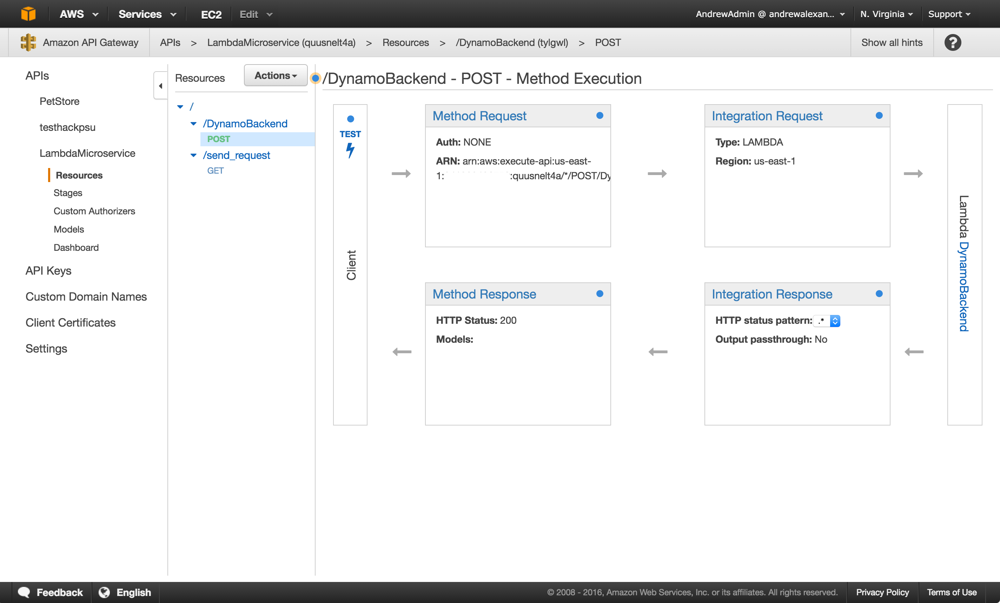

#### Deploy API with API token
This is all well and good while you have console access, but in order to actually be useful in a hack, you will need to be able to use an API token (at minimum) in order to authorize access to the API and let us use the newly generated URL to POST/GET/PUT to.

To do this, click `Usage Plans` on the left and Click `Create`. Give it a unique name and an optional description. I usually enable throttling at a rate of 250 and a burst of 500 with no quota. Then click Next.

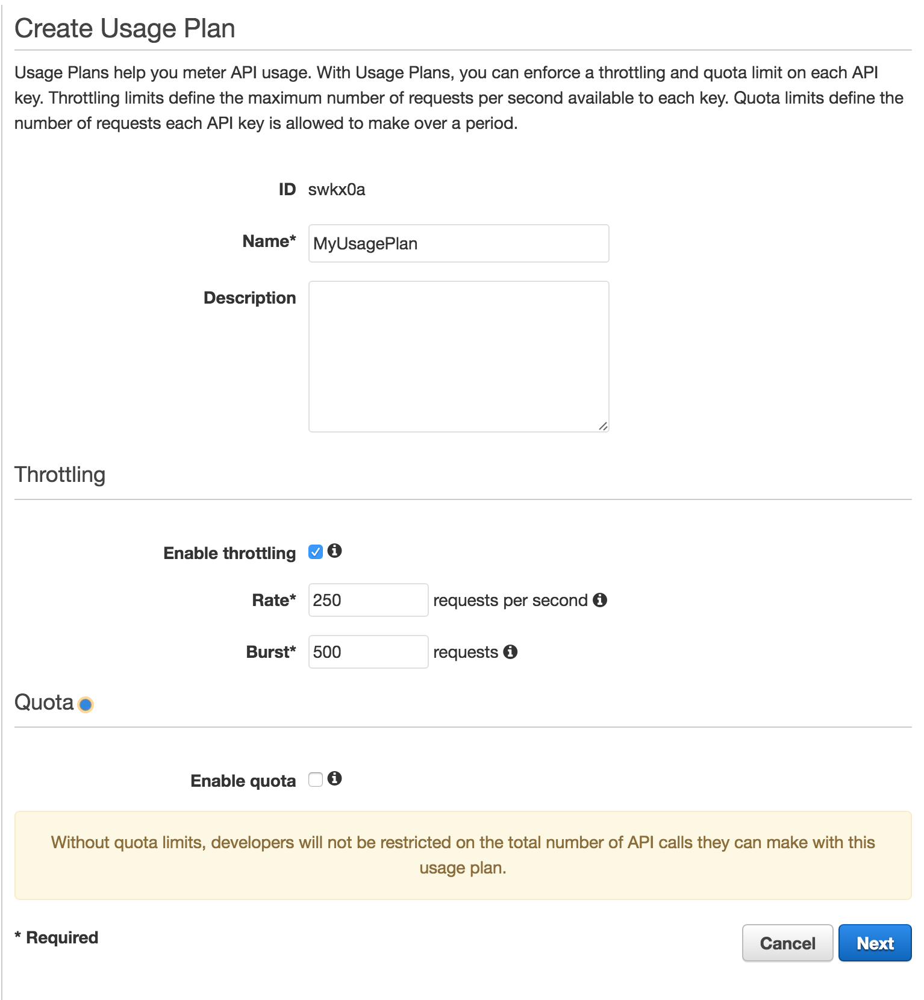

Now add the `dev` stage to your usage plan. When lambda created the API for you, it already created this. We are just associating it with your usage plan. However, things are known to get messed up, so if you don't see a pre-populated stage, you can go into the API itself and add it there.

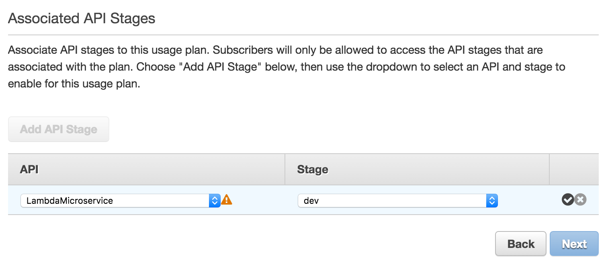

One fun thing to note is that we get a warning about our endpoints not being protected with an API key (thanks Amazon!) - we will be updating this in a second. Also, be sure to click the checkmark to actually add the rule so you can click Next. 

Now we want to `Create API Key and add to Usage Plan`. Give it any name you want and let it auto-generate for you. Now we are done!

Then go to `API Keys` on the left and select the key you just created to grab it for use later. Just click `Show` and it will have the alphanumeric API key ready for you to use in some API requests.

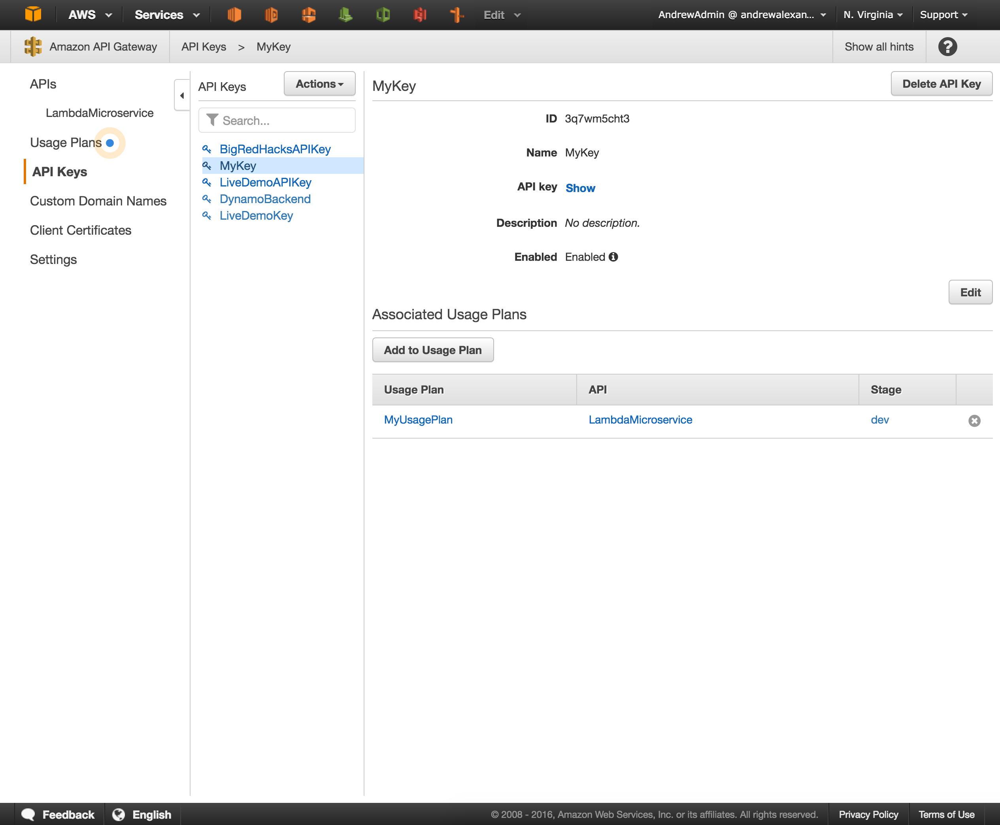

#### Set up our endpoint to use the API Key
Based on our choice to have our API open with an access key, the default position for new endpoints is to be wide open. Obviously, this isn't what we want so in order to protect our endpoint with the key, we need to configure it as such. Doing so is pretty straight forward.

Click your API on the left under `APIs`, and then click the method you want to protect under the list of resources (POST, GET, etc). You will then see the flowchart view again. We want to click the `Method Request` to open up the options for that specific request, and set `API Key Required` equal to `true`. If you have multiple endpoints (different endpoints to POST or one for GET, one for POST, etc.), you will need to repeat this process for each endpoint. 

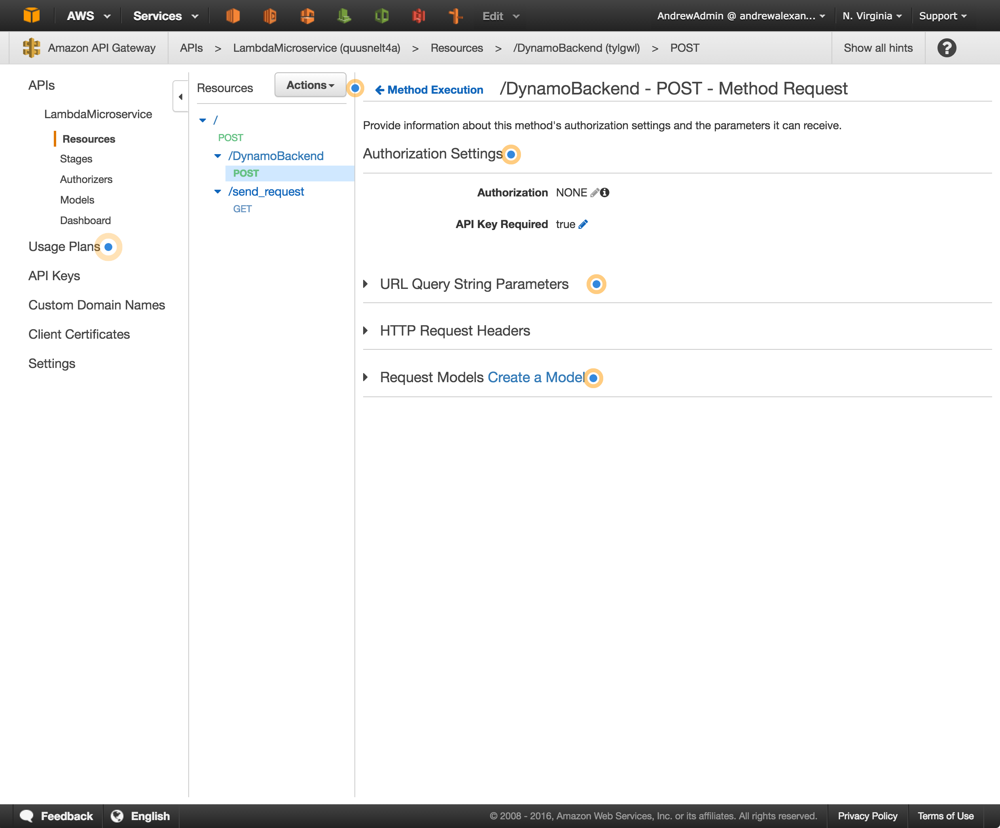

We are almost done! But before we can test out our backend using the URL provided by API Gateway, we need to deploy the API.

To deploy, just click Actions -> Deploy API. You can change settings here if you want to, but you can always change them later and/or re-deploy your API. 

To change settings later, go to APIs -> LambdaMicroservice -> {Resource Name}(was `DynamoBackend` in this example) -> Stages.

Once you deploy the API, you will be given an actual URL that you can use for typical REST API calls like you would in any other language. You can export the Swagger UI JSON/YAML for easy generation of API docs. You can also generate an SDK for easy incorporation into an iOS/Android/JavaScript project. 

I like to use [Postman](https://www.getpostman.com/) for testing APIs, since it makes it super easy to add headers/edit the payload being sent. The biggest plus of Postman though is that once you get the request working in Postman, you can export to almost any language to copy/paste the code directly in to your project and you can rest assured that it will Just WorkTM.

Regardless of what you use, be sure to add the Header `x-api-key` with the API key you grabbed earlier to authenticate your requests. In other words, you will want {'x-api-key': 'long-alphanumeric-api-key-here'} as a key-value pair in the Header of every request to your API.

## Other Event-based Lambdas:
Time permitting, we can walk through some of these as well. If not, I will be available for questions throughout the Hackathon.

- S3
  * Perform image manipulation in response to new S3 objects
  * Automatically encrypt any/all S3 objects
- SNS
  * Unique for each event
  * Can be used as trigger for any Lambda
- Alexa
  * Create your own voice commands that execute as Lambda functions
  * _Caveat_: I've never gotten a chance to mess with Alexa yet
- CloudWatch Events
  * Nearly all AWS APIs (EC2 creation, RDS creation/updates, Lambda creation/updates)
  * Usually used for notification/compliance purposes
